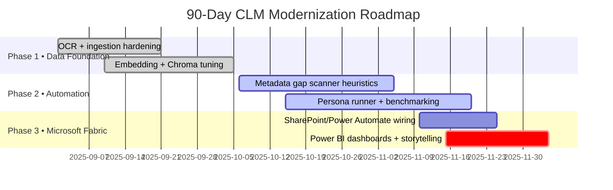

# Contracts Copilot for Enterprise (Google ADK + Microsoft Fabric)

This repository is the code bundle I am submitting to the [Kaggle Agents Intensive Capstone](https://www.kaggle.com/competitions/agents-intensive-capstone-project). It demonstrates how to build a contracts lifecycle copilot that starts with Google ADK experimentation, then hardens into a Microsoft-first production workflow using completely local models for sensitive data.

## Executive Snapshot

* **Mission:** compress contract review from week-long queues to a same-day metadata refresh backed by explainable AI.
* **Stack fusion:** Google ADK provides the agent brain, while Microsoft Fabric/Power BI deliver the enterprise hand-off for legal, finance, and procurement.
* **Security stance:** no production documents leave the workstation—Ollama, ChromaDB, and `.env`-driven secrets keep everything offline.
* **Deliverable:** three runnable CLM blueprints plus export tooling, so judges can see the evolution from hackathon idea to enterprise rollout.

### Visual Flow

```text
┌──────────┐      ┌───────────────┐      ┌───────────────┐
│ Phase 1  │ ───▶ │ Phase 2       │ ───▶ │ Phase 3       │
│ Ingest   │      │ Gap Automation│      │ Microsoft FAB │
│ ADK/LLM  │      │ Local ADK     │      │ Power Platform│
└──────────┘      └───────────────┘      └───────────────┘
		 ▲                    │                        │
		 │                    ▼                        ▼
	 OCR +             Persona judge          SharePoint / BI
	 embeddings        + guardrails           dashboards + flows
```

The codebase contains three complementary implementations of the same workflow:

| Implementation | Purpose | Notes |
| --- | --- | --- |
| `clm_enterprise.py` | Enterprise-scale ingestion + metadata enrichment | Cloud ADK prototyping, full SharePoint routing, power-user tooling |
| `clm_multi_agent_fixed.py` | Multi-agent orchestration with contract-family reasoning | Explores Gemini tools for master/SOW relationships and amendments |
| `clm_with_chromadb.py` | Production pipeline using ChromaDB + local LLMs (Ollama) | Final security-focused build that powers Phase 1/2/3 below |

These files share utilities such as guardrails, folder heuristics, and export pipelines. They are intentionally self-contained so disclosing the repository will not leak any real contracts or PII.

---

## Phase Plan

| Phase | Goal | Key Scripts |
| --- | --- | --- |
| **Phase 1 – Ingestion & Guardrails** | Normalize PDFs/Word docs, extract text, create embeddings, capture primary metadata | `clm_with_chromadb.py`, `ingest_extraction_test_batch.py`, `local_llm_adapter.py`, `local_models.py` |
| **Phase 2 – Metadata Gap Automation** | Detect high-value metadata gaps and fill them with a contracts-specialist ADK agent running locally | `metadata_gap_scanner.py`, `metadata_gap_runner.py`, `contract_model_comparison.py` |
| **Phase 3 – Microsoft Integration** | Push curated metadata to SharePoint, Power Automate, and Power BI for executive dashboards | `export_for_sharepoint.py`, `export_metadata_to_excel.py`, `export_for_powerbi.py`, `POWERBI_SETUP_GUIDE.md`, `powerbi_visual_generators.py` |

All three phases are present in this repo so the Kaggle submission can show end-to-end readiness plus a roadmap for the Microsoft ecosystem (Fabric Lakehouse, Power Automate approvals, adaptive cards, etc.).

> **Focus for judges:** Phase 1 proves data quality, Phase 2 shows autonomous enrichment, Phase 3 shows the reporting surface executives will actually use.

## Mermaid System Flow

```mermaid
flowchart LR
	subgraph Phase1[Phase 1 • Ingestion]
		A[OCR + chunking] --> B[Legal-BERT embeddings]
		B --> C[ChromaDB memory]
	end
	subgraph Phase2[Phase 2 • Metadata Gap Automation]
		C --> D[metadata_gap_scanner]
		D --> E[metadata_gap_runner (ADK persona)]
		E --> F[Judge + logging]
	end
	subgraph Phase3[Phase 3 • Microsoft Fabric]
		F --> G[SharePoint JSON exports]
		F --> H[Power BI parquet feeds]
		H --> I[Executive dashboards]
		G --> J[Power Automate approvals]
	end
```

---

## Architecture Highlights

1. **Multi-implementation strategy** – The `clm_*` variants let me compare pure cloud ADK agents (useful for benchmarking), hybrid multi-agent reasoning, and the final local-only build that is safe for contracts subject to export control.
2. **ChromaDB + Legal-BERT embeddings** – Keeps a local contract memory that can be shared with ADK agents or Power BI without sending sensitive content out of the tenant.
3. **Contracts-specialist persona** – Phase 2 uses a judge/self-healing runner (`metadata_gap_runner.py`) that prompts the model like a senior contracts specialist with explicit rules for MSAs, SOWs, amendments, schedules, NDAs, and GDPR handling.
4. **Master/SOW lineage** – `metadata_gap_scanner.py` groups documents by folder lineage and contract IDs, inherits governing metadata from MSAs, and only escalates fields truly missing in child documents.
5. **Microsoft integration hooks** – Exports land in SharePoint-compatible JSON/Excel, parquet feeds for Fabric, Power Automate sample flows (see `POWER_AUTOMATE_FLOWS.md`), and ready-to-use DAX measures for dashboards.

---

## Quick Start

Use the following PowerShell commands to clone the repo and install dependencies:

```bash
$Env:REPO_URL = 'https://github.com/wtrout187/adktest1.git'
git clone $Env:REPO_URL
cd adktest1
python -m venv venv
venv\Scripts\activate
pip install -r requirements_enhanced.txt

# Configure environment
copy config/.env.example config/.env   # contains placeholders only
# Fill in non-sensitive knobs (model provider, folder roots, etc.)
```

> **Security note:** No production SharePoint credentials or API keys live in this repo. Keep your tenant-specific values in `config/*.env` or OS-level variables; `.gitignore` already excludes them.

---

## Running the Phases

### Phase 1 – Load + Guardrail

```bash
python ingest_extraction_test_batch.py --batch-size 8 --limit 100 --force
```

* Parses PDFs/Word docs (Tesseract + Ghostscript), extracts metadata, writes embeddings to ChromaDB (`chroma_db/`).

### Phase 2 – Find & Fix Metadata Gaps

```bash
python metadata_gap_scanner.py --top-prompts 15 --snippet-chars 900
python metadata_gap_runner.py --top-prompts 15 --snippet-chars 900 --local-model llama3.2:1b
```

* Scanner ranks missing fields (auto-renewal, payment terms, GDPR flags, addresses, governing law, etc.) while inheriting everything already defined in a master agreement.
* Runner executes a local ADK agent (via `local_llm_adapter.py`) with guardrails, judge logic, and logging to `metadata_gap_runs/`.

### Phase 3 – Export & Visualize

```bash
python export_for_sharepoint.py --output sharepoint_exports/contracts.json
python export_for_powerbi.py --output powerbi_exports/contracts.parquet
```

* Outputs align with SharePoint columns, GDPR rules, and the Fabric table schema documented in `POWERBI_SETUP_GUIDE.md`.
* Use `powerbi_visual_generators.py` + `powerbi_dax_measures.txt` to bootstrap the BI dashboard referenced in the Kaggle write-up.

---

## Local vs Cloud Model Strategy

| Mode | When to use | How to enable |
| --- | --- | --- |
| **Cloud (Gemini) benchmarking** | Kaggle experiments, reproducible baselines | Set `CLM_MODEL_PROVIDER=gemini` + `CLM_GEMINI_MODEL=gemini-2.5-flash` in env |
| **Local (Ollama) production** | Secure tenants / air-gapped review | Set `CLM_MODEL_PROVIDER=local` and choose any profile from `config/local_model_settings.json` |

Benchmarks (`contract_model_comparison.py`, `local_model_probe.py`) helped select `llama3.2:1b` for throughput and `llama3.2:3b` for tricky patches, both running entirely on the workstation.

---

## Repository Guide

Key files to highlight in the Kaggle submission:

```text
clm_enterprise.py             # Enterprise ingestion + SharePoint logic
clm_multi_agent_fixed.py      # Multi-agent (Gemini) experimentation
clm_with_chromadb.py          # Production-local pipeline
metadata_gap_scanner.py       # Phase 2 scanner with contract heuristics
metadata_gap_runner.py        # ADK runner + judge/self-healing loop
export_for_sharepoint.py      # Phase 3 SharePoint mapping
export_for_powerbi.py         # Fabric/Power BI export helper
POWER_AUTOMATE_FLOWS.md       # Sample flow design for approvals
POWERBI_SETUP_GUIDE.md        # Fabric workspace instructions
powerbi_visual_generators.py  # Scripted visuals/DAX helpers
```


Diagnostics (`check_*.py`, `diagnose_*.py`, `verify_*.py`) are optional but included so reviewers can reproduce the ingestion and validation pipeline without real contracts. All content directories (`chroma_db/`, sample exports, etc.) contain either synthetic data or empty placeholders.

### Submission Checklist (internal)

* [x] README tells the story for all three CLM variants.
* [x] Synthetic exports only; verified no sensitive PDFs committed.
* [ ] Optional (deferred): record short Loom of Phase 2 run (script below) before final submission.

---

## Kaggle Submission Focus

1. **Show multi-agent versatility** – By keeping three `clm_*` implementations, the submission proves I can start with Google ADK tutorials, scale to multi-agent planning, and finish with an enterprise-ready build.
2. **Demonstrate secure operations** – Everything after benchmarking runs locally (Ollama, ChromaDB, `.env`-driven config). No proprietary contract text is committed.
3. **Bridge to Microsoft Fabric** – The final phase explains how Power BI dashboards, Power Automate approval workflows, and SharePoint exports consume the same metadata enriched by ADK.

### Launch Timeline (Mermaid Gantt)



### Demo Pitch Script (2 minutes)

1. **Hook (0:00–0:20):** “Imagine contracting teams where metadata updates land the same day a new SOW hits SharePoint—no midnight spreadsheet hunts.”
2. **Show (0:20–1:10):** Run `metadata_gap_scanner.py` → `metadata_gap_runner.py`, narrating how the persona judge justifies each autofill.
3. **Tell (1:10–1:40):** Flip to Power BI export, highlight risk tiles auto-populated for GDPR, payment terms, auto-renewal.
4. **Close (1:40–2:00):** Reiterate that everything stays local, yet hands results to Fabric dashboards legal already trusts.

---

## Contributing / Next Steps

* Extend `metadata_gap_runner.py` with more personas (procurement, legal, finance) for richer judgments.
* Package the ingestion + repair pipeline as an Azure Container App so it can drop results directly in Fabric Lakehouse tables.
* Finish the Power BI template (linked in `powerbi_exports/`) for Phase 3 of the Kaggle plan.

PRs and forks are welcome—just keep the repo free of real contract files and API secrets.

---

**Author:** Wayne Trout (`wtrout187`)  
**Contest:** Kaggle Agents Intensive Capstone  
**Stack:** Google ADK · Ollama · ChromaDB · Microsoft Fabric · Power BI · Power Automate
